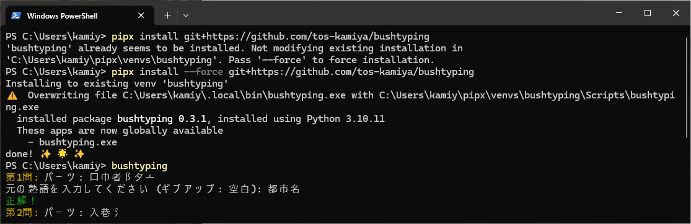

[→ Japanese README](README.md)

# Bushu Typing Game

Test your knowledge of Kanji characters! Solve radical puzzles for brain training!

* Levels range from 1st grade elementary school to 1st-level Kanji Proficiency Test.
* Note: The vocabulary used may not necessarily be standard dictionary entries.

### Screenshots




## Install and Run

Install using pipx:

```bash
pipx install git+https://github.com/tos-kamiya/bushtyping
```

Run the game after installation with:

```bash
bushtyping [level]
```

Examples:

```bash
bushtyping s3  # Elementary School 3rd Grade Level
bushtyping j1k # Pre-1st Level Kanji Proficiency Test
bushtyping     # Default: Elementary School 3rd Grade Level
```

## Usage

* Enter the original vocabulary word when prompted with radicals.
* You can attempt each question up to 3 times. Entering an empty string will show the answer immediately.
* The game ends after 10 questions, displaying your accuracy and time taken.

## Options

* `s1`, `s2`,..., `s6`: Elementary School grades 1-6
* `c2`, `c3`: Junior High School grades 2-3
* `k`: High School level
* `j1k`: Pre-1st Level Kanji Proficiency Test
* `1k`: 1st Level Kanji Proficiency Test
* `j`: Common-Use Kanji

## License

* MIT License (Python code)
* Creative Commons Attribution-Share Alike 4.0 International (Data: `data/kanji2radical_*.json`, Source: https://github.com/yagays/kanjivg-radical/)
* CC BY 4.0 (Data: `data/小1/`, `data/高校/` etc., Source: https://github.com/marmooo/graded-idioms-ja/

## Acknowledgments

We would like to thank the following individuals and organizations for their contributions:

* Data for matching Kanji with radicals: [yagays/kanjivg-radical](https://github.com/yagays/kanjivg-radical/) (Creative Commons Attribution-Share Alike 4.0 International)
* Vocabulary data: [marmooo/graded-idioms-ja](https://github.com/marmooo/graded-idioms-ja/) (CC BY 4.0)

Special thanks to Gemini Advanced 2.0 Flash for generating and correcting most of the code.
