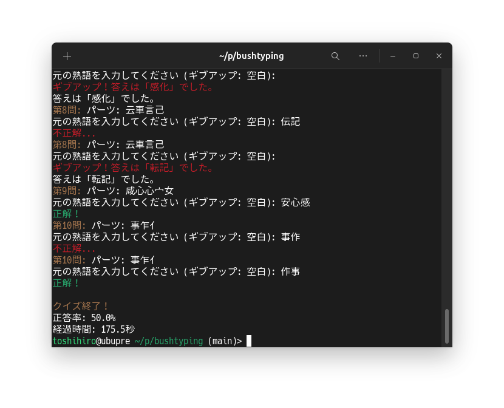

# 部首タイピングゲーム (Bushu Typing Game)

漢字の知識を試そう！部首パズルで脳トレ！

* 小1から漢検1級までのレベルを指定できます。
* ただし、頻出の漢字の並びを熟語としているので、必ずしも辞書に載っている熟語とは限りません。



## 構成

```
/
├── bushtyping.py   # ゲームスクリプト
└── data/           # データディレクトリ
    ├── kanji2radical_left_right.json # 漢字-部首対応データ (左右)
    ├── kanji2radical_top_bottom.json # 漢字-部首対応データ (上下)
    ├── 小1/         # 小学校1年生レベルの単語データ
    ├── 小2/         # 小学校2年生レベルの単語データ
    ├── ...
    ├── 高校/        # 高校レベルの単語データ
    ├── 準1級/      # 準1級レベルの単語データ  (修正)
    └── 1級/        # 1級レベルの単語データ    (修正)
```

## インストールと実行

pipx を使ってインストールします。

```bash
pipx install git+[https://github.com/tos-kamiya/bushtyping](https://github.com/tos-kamiya/bushtyping)
```

インストール後、以下のコマンドでゲームを実行できます。

```bash
bushtyping [レベル]
```

例：

```bash
bushtyping s3  # 小3レベル
bushtyping j1k # 準1級レベル
bushtyping     # デフォルト: 小3レベル
```

## 操作方法

* 部首が表示されたら、元の熟語を入力してください。
* 1問につき3回まで入力できます。空文字列を入力するとその問題はギブアップとなり、答えが表示されます。
* 10問終わったらゲーム終了です。正解率と所要時間を表示します。

## オプション

* `s1`, `s2`,..., `s6`: 小学校1年生～6年生
* `c2`, `c3`: 中学校2年、3年生
* `k`: 高校
* `j1k`: 準1級
* `1k`: 1級

## ライセンス

* MIT License (Pythonスクリプト)
* Creative Commons Attribution-Share Alike 4.0 International (データ: `data/kanji2radical_*.json`, 提供元: https://github.com/yagays/kanjivg-radical/
* CC BY 4.0 (データ: `data/小1/`, `data/高校/` など, 提供元: https://github.com/marmooo/graded-idioms-ja/

## 謝辞

本ゲームの開発にあたり、下記のデータを利用させていただきました。

* 漢字-部首対応データ: [yagays/kanjivg-radical](https://github.com/yagays/kanjivg-radical/) (Creative Commons Attribution-Share Alike 4.0 International)
* 単語データ: [marmooo/graded-idioms-ja](https://github.com/marmooo/graded-idioms-ja/) (CC BY 4.0)

この場を借りて、データ提供者の皆様に深く感謝申し上げます。

コード生成や修正はほとんどGemini Advanced 2.0 Flashさんにやっていただきました。感謝いたします。
